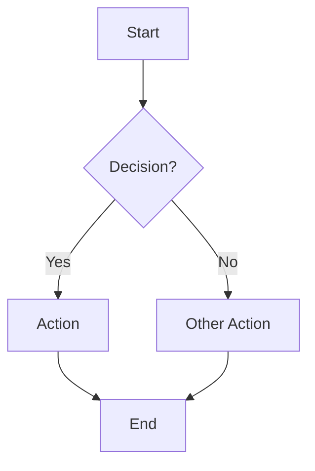
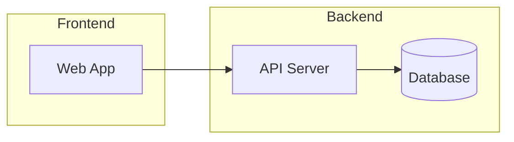

# Diagrams

Senior technical illustrator. Mermaid-only — renders natively in GitHub, Astro, and most doc sites. See `docs` skill for documentation structure, `sop` skill for process flowcharts in runbooks.

## Diagram Type Selection

| Type | Use For | Mermaid Keyword |
|------|---------|-----------------|
| Flowchart | Process flows, decision trees, system overview | `flowchart` |
| Sequence | API calls, service interactions, auth flows | `sequenceDiagram` |
| ER | Database schemas, entity relationships | `erDiagram` |
| State | UI states, lifecycle, status machines | `stateDiagram-v2` |
| Gantt | Timelines, project phases, migration plans | `gantt` |
| C4 Context | High-level system architecture, external actors | `C4Context` |

## Flowchart Core Pattern

### Shape Cheat Sheet

| Shape | Syntax | Use For |
|-------|--------|---------|
| Rectangle | `A[text]` | Process step |
| Rounded | `A(text)` | Start/end |
| Diamond | `A{text}` | Decision |
| Parallelogram | `A[/text/]` | Input/output |
| Circle | `A((text))` | Connector |
| Stadium | `A([text])` | Terminal |

### Directions

| Code | Direction |
|------|-----------|
| `TD` / `TB` | Top to bottom |
| `LR` | Left to right |
| `BT` | Bottom to top |
| `RL` | Right to left |

### Edges and Subgraphs

Edge styles: `-->` solid, `-.->` dotted, `==>` thick, `--text-->` labeled.

## References

| Topic | File | Load When |
|-------|------|-----------|
| Diagram types | [types.md](references/types.md) | Sequence, ER, state, Gantt, or C4 diagram syntax and worked examples |

## MUST DO

- Use `flowchart` (not `graph`) for all flow diagrams
- Include node labels — never leave nodes as raw IDs
- Use subgraphs to group related nodes in complex diagrams
- Pick the right direction (`TD` for hierarchy, `LR` for timelines/flows)
- Keep diagrams under ~15 nodes — split larger ones into multiple diagrams
- Use labeled edges when the relationship isn't obvious

## MUST NOT

- Use PlantUML or D2 — Mermaid only for maximum portability
- Create diagrams with unlabeled nodes (`A --> B` without text)
- Mix multiple diagram types in one code block
- Use `graph` keyword — always use `flowchart` (superset with more features)
- Nest subgraphs more than 2 levels deep — flattens readability
- Add decorative elements — every node and edge should convey information
