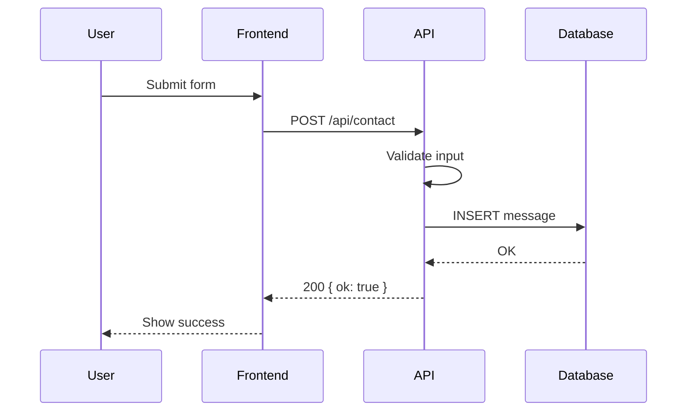
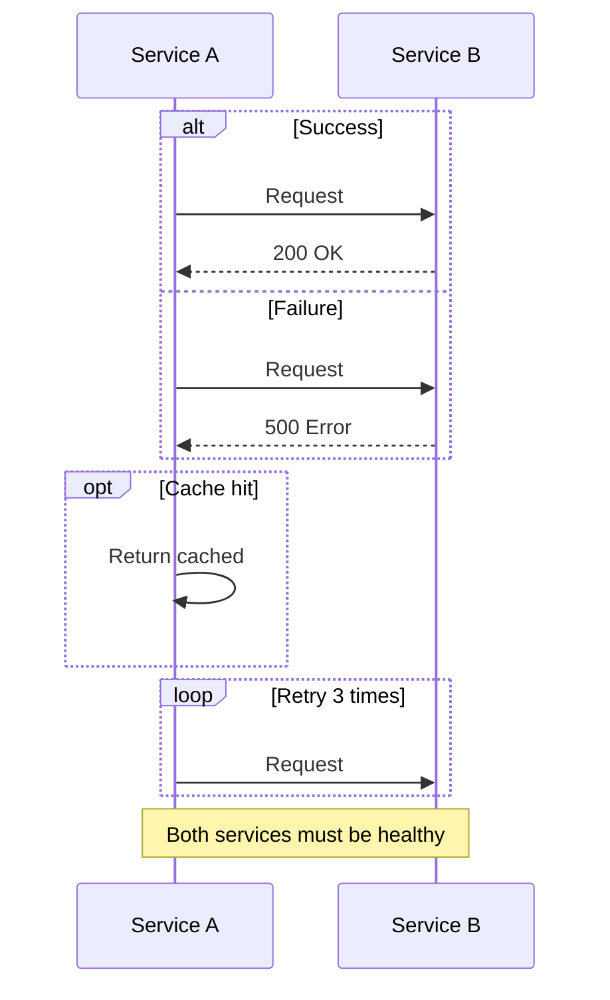
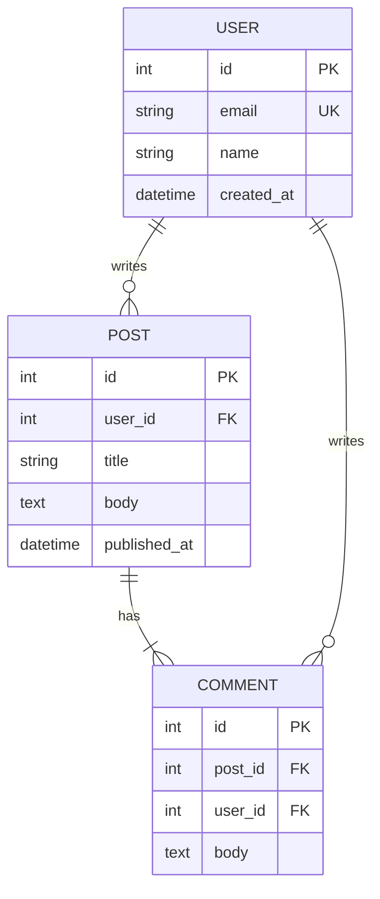
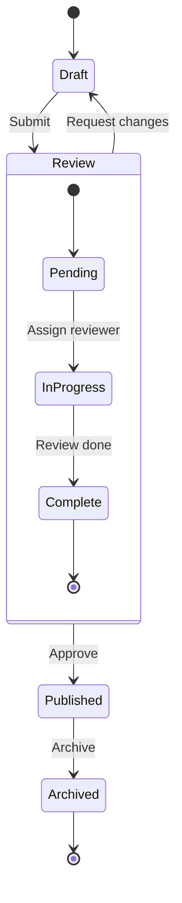
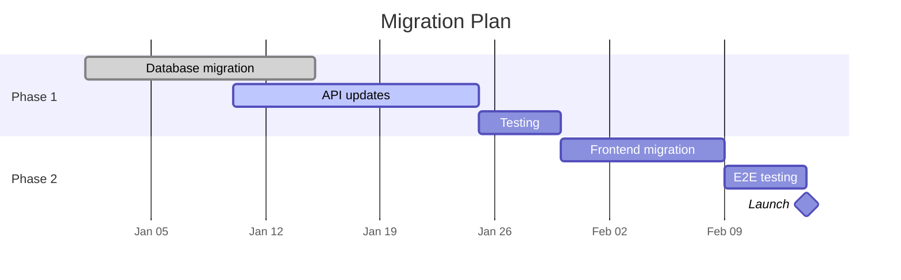
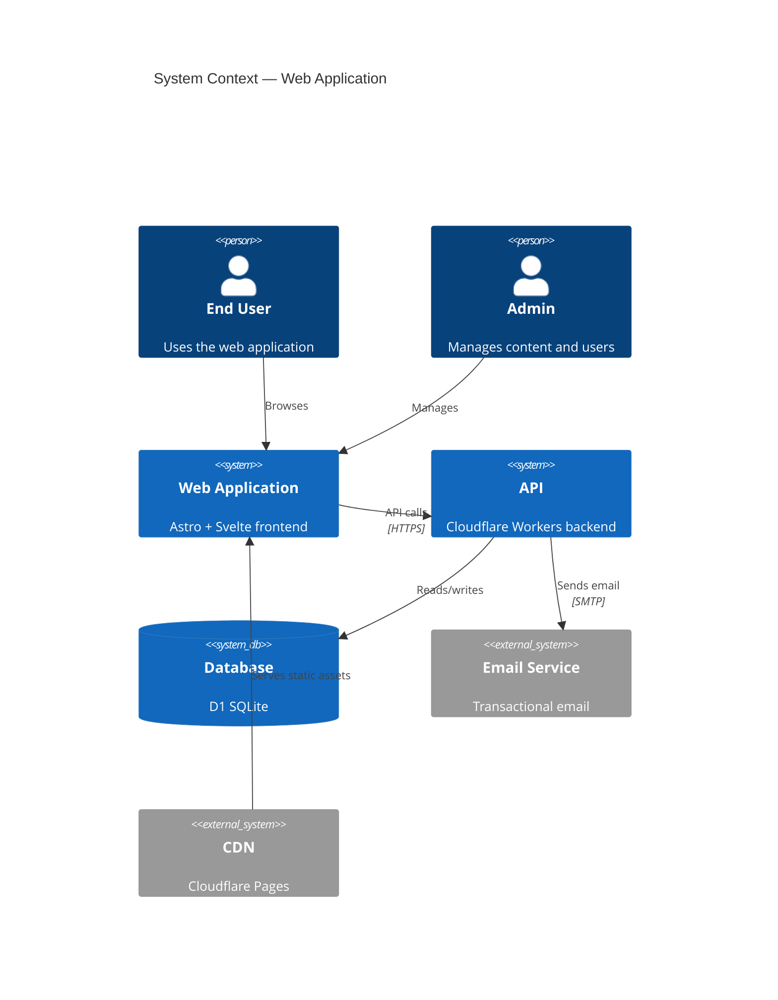

# Diagram Types Reference

Worked examples and syntax traps for each Mermaid diagram type beyond flowcharts.

## Sequence Diagrams

Model API calls, service interactions, and authentication flows.

### Arrow Types

| Arrow | Meaning |
|-------|---------|
| `->>` | Solid with arrowhead (request) |
| `-->>` | Dotted with arrowhead (response) |
| `->>+` | Activate lifeline |
| `->>-` | Deactivate lifeline |
| `-x` | Lost message |

### Features

### Syntax Traps

- **Participant aliases are required** for readable labels — `participant U as User`
- **`alt`/`else`/`end`** for conditionals, `opt`/`end` for optional, `loop`/`end` for repetition
- **Messages cannot be empty** — every arrow needs label text
- **Activation** (`+`/`-`) must be balanced — every activate needs a deactivate

## ER Diagrams

Model database schemas and entity relationships.

### Relationship Notation

| Left | Right | Meaning |
|------|-------|---------|
| `\|\|` | `\|\|` | Exactly one |
| `\|\|` | `o{` | One to zero or many |
| `\|\|` | `\|{` | One to one or many |
| `o\|` | `o{` | Zero or one to zero or many |

### Column Markers

| Marker | Meaning |
|--------|---------|
| `PK` | Primary key |
| `FK` | Foreign key |
| `UK` | Unique key |

### Syntax Traps

- **Relationship labels are mandatory** — `USER ||--o{ POST : writes` (the `: writes` part)
- **No spaces in entity names** — use `BLOG_POST` not `Blog Post`
- **Column types are simple strings** — `string`, `int`, `text`, `datetime`, `boolean`
- **Circular relationships are allowed** — but keep them to a minimum for readability

## State Diagrams

Model UI states, lifecycles, and status machines.

### Features

- **`[*]`** — start/end pseudo-state
- **Nested states** — `state Name { ... }` for composite states
- **Transitions** — `State1 --> State2: event` with labeled triggers
- **Choice** — `state fork <<choice>>` for decision points
- **Notes** — `note right of State: text`

### Syntax Traps

- **Always use `stateDiagram-v2`** — v1 syntax is deprecated
- **State names cannot have spaces** — use `InProgress` not `In Progress`
- **`[*]` is both start and end** — Mermaid infers from context
- **Nested states need the `state` keyword** — not just indentation

## Gantt Charts

Model project timelines, migration phases, and release schedules.

### Task Status Tags

| Tag | Rendering |
|-----|-----------|
| `done` | Completed (filled) |
| `active` | In progress (striped) |
| `crit` | Critical path (red) |
| (none) | Future (default) |

### Duration Formats

- **Absolute dates**: `2025-01-01, 2025-01-15`
- **Duration**: `2025-01-01, 10d` (days)
- **After dependency**: `after taskId, 5d`
- **Milestone**: `milestone, name, after taskId, 0d`

### Syntax Traps

- **`dateFormat` is mandatory** — omitting it causes parse errors
- **Task IDs must be unique** across all sections
- **`after` references use task ID**, not task label
- **Milestones need `0d` duration** — not just the `milestone` tag

## C4 Architecture Diagrams

Model high-level system context with external actors and system boundaries.

### Element Types

| Function | Purpose |
|----------|---------|
| `Person(id, label, desc)` | Human actor |
| `System(id, label, desc)` | Internal system |
| `SystemDb(id, label, desc)` | Database |
| `System_Ext(id, label, desc)` | External system |
| `Boundary(id, label)` | System boundary grouping |
| `Rel(from, to, label, tech)` | Relationship |

### Syntax Traps

- **Only `C4Context` is well-supported** in Mermaid — `C4Container` and `C4Component` have limited rendering
- **IDs must be alphanumeric** — no hyphens or special characters
- **Descriptions are optional** but strongly recommended for readability
- **`Rel` requires at least 3 args** — `from`, `to`, `label` (tech is optional)
- **No nested boundaries** in context diagrams — use container diagrams for that level
